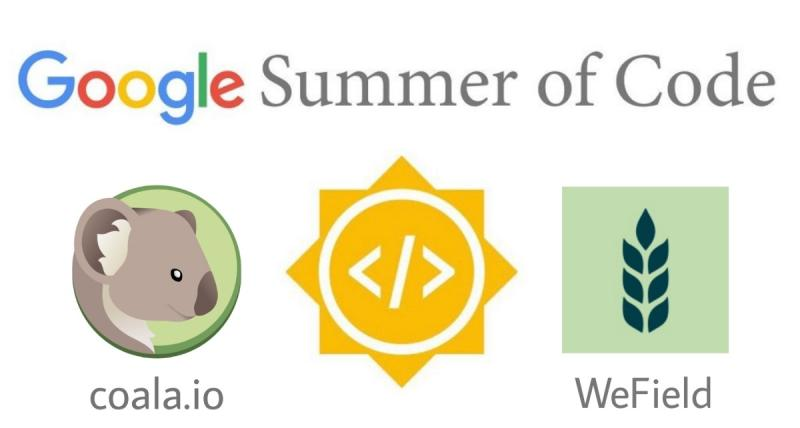
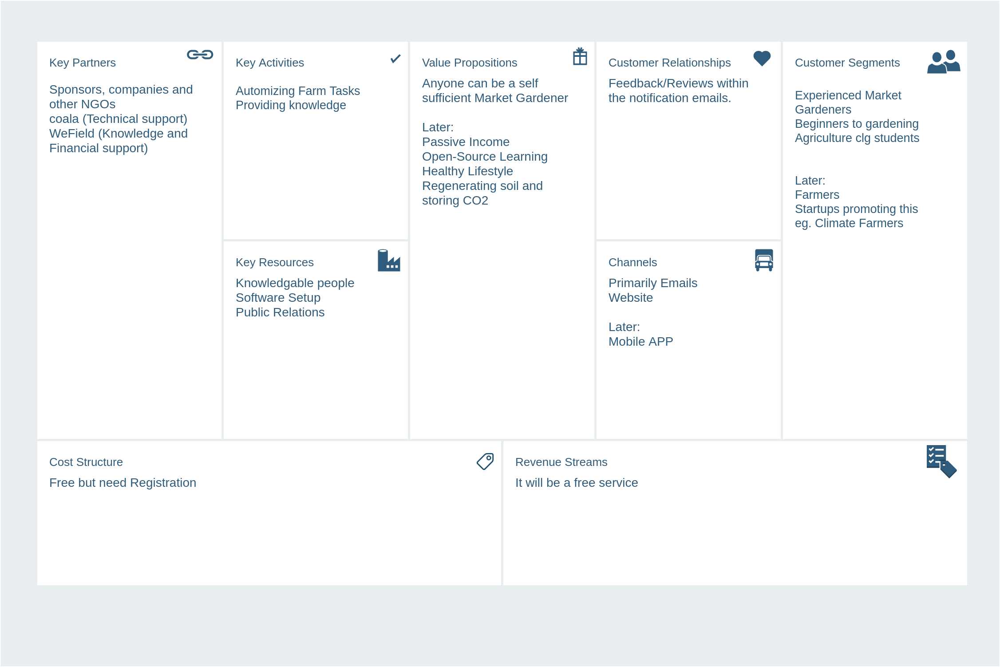
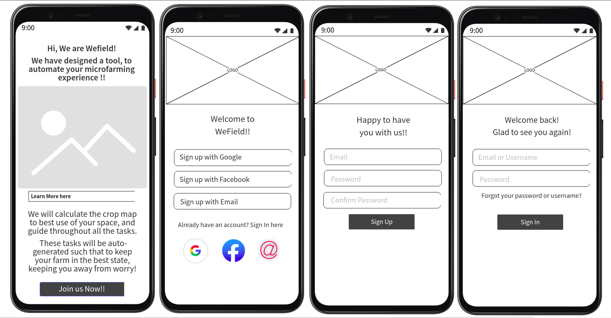
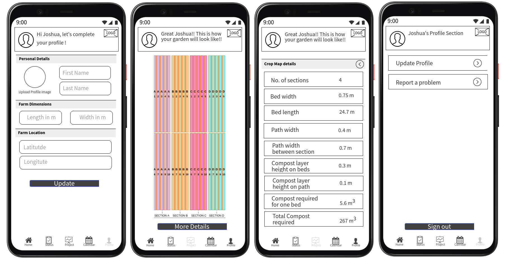
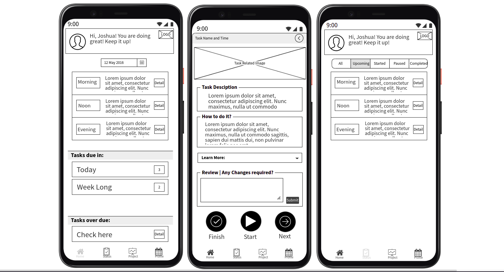
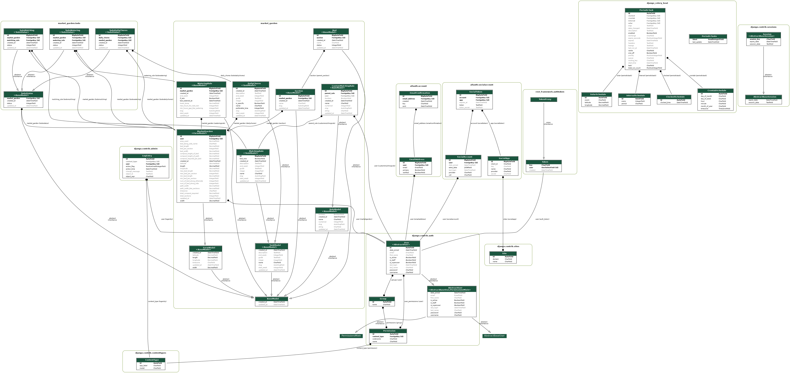

    

        
    

# Django-microfarm

This project is part of the [Google Summer of Code 2021][4] of the Sub
Organization named [WeField e.V.][2] under the umbrella of [coala Association
e.V.][1] It is also mentioned on coala Projects site [here][3]. [WeField
e.V.][2] is a German NGO that takes regenerative and climate actions on
monocultural used Wasteland. This project will promote market gardening among
the people. They will be growing their vegetables, fruits all by themselves.
They can even sell their products as a source of passive income.

This project aims to create a tool that allows anyone to become a market
gardener, given some space. As a first step, a user will merely sign up and
enter the amount of space that they wants to use. The system will then trigger
tasks the user has to do to farm on his space efficiently. Those tasks are
triggered by simple rules and may depend on weather events, date, and later also
other triggers. Thus, anyone can be a market gardener, and this tool will be
beneficial and easy to use.

# Business Model Canvas
Below is the business model canvas of the product we are aiming to build, for
clearer picture of our aim and moto:

    

        
    

# Wireframe of the application
Below are the images of our final product in the near future: `Mobile
application`

    

        <b>1. Login Page</b> 
          
        <b>2. Profile Page</b> 
          
        <b>3. Task Page</b> 
          
    

# Class Diagram

    

        
    

# Project Report
Visit for more detailed insights about the work done till now [here][5].

# Link to the blogs

 - [Starting with GSoC’21 @coala @WeField][6]
 - [Approaching the Project: Microfarm for Everybody][7]
 - [GSoC Coding Phase 1 in one glimpse][8]
 - [GSoC Coding Phase 2 in one glimpse][9]

[1]: https://coala.io "coala.io Website"
[2]: https://www.wefield.org/ "WeField Website"
[3]: https://projects.coala.io/#/projects?project=django-microfarm&lang=en "coala Project link"
[4]: https://summerofcode.withgoogle.com/projects/#6093515215339520 "GSoC Project Page link"
[5]: https://projects.coala.io/GSoC/2021/StatusReport/pra17dod.html "Project Report"
[6]: https://pra17dod.medium.com/starting-with-gsoc21-coala-wefield-207429cf2eaf "Blog 1"
[7]: https://pra17dod.medium.com/approaching-the-project-microfarm-for-everybody-5f8a7834a14 "Blog 2"
[8]: https://pra17dod.medium.com/gsoc-coding-phase-1-in-one-glimpse-a9115d51c2a1 "Blog 3"
[9]: https://pra17dod.medium.com/gsoc-coding-phase-2-in-one-glimpse-351ba5ec3871 "Blog 4"